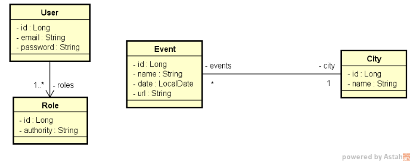

<h2 align="center">
   Validation and Security - Spring Boot Bootcamp Project 0.3
</h2>

<figure>

  

</figure>

# About
REST event API done as the third task of DevSuperior Spring React Bootcamp 3.0, using Spring Boot and persisting to h2 database using Spring Data JPA.
The repository has been forked from devsuperior/bds04 with integration tests already done. To complete the task, I needed to create User and Role Entities, repositories, services, controllers, validations, and oauth2 configurations to pass the tests.

In this system, only the reading routes (GET) of events and cities are public (no login required). CLIENT users can also post (POST) new events. Other accesses are only allowed to ADMIN users.

[DevSuperior](https://devsuperior.com.br/) Spring Boot Bootcamp Project 0.3: Validation and Security. 

## Validation and Security
- Bean Validation
- OAuth 2.0
- Token JWT - authentication e authorization
- Spring Security

## City Validations:
- Name cannot be empty

## Event Validations:
- Name cannot be empty
- Date cannot be passed
- City cannot be null

## ResourceServerConfig authorization rules described in natural language.
- Login and H2 endpoints must be public
- GET endpoints for /cities and /events must be public
- POST endpoint of /events must require ADMIN or CLIENT login
- All other endpoints must require ADMIN login

## Technologies used
- STS (Spring Tool Suite)
- PostMan
- PostgreSQL 12
- PgAdmin

## Back end
- Java 17 
- JDK 17 ZULU
- Spring Boot
- JPA / Hibernate
- Maven

## Images
<figure>

  
    
  <figcaption>Conceptual Model</figcaption>

</figure>
 
 
<figure>

  
    
  <figcaption>Pattern Layers</figcaption>

</figure>
 
 

<h5 align="center">
  &copy;2023 - <a href="https://github.com/KarinaRovani/">Karina de Oliveira Rovani</a>
</h5>

